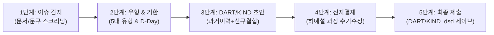

# 📄 (주)와이바이오로직스 DART/KIND 전자공시 자동화 시스템 구축 완료 보고서

---

## 🏆 1. 프로젝트 개요 (Executive Summary)

본 사업은 **(주)와이바이오로직스(Y-Biologics, 코스닥 338840)**의 공시 업무 실무 생산성 향상 및 법률 준수 검증을 위해, 비구조화 이슈 파싱부터 DART/KIND 외부 포털 최종 제출까지의 **5단계 공시 풀 파이프라인 자동화 시스템**을 구축한 프로젝트입니다.

실무 담당자인 **허예설 과장**의 실제 업무 동선에 최적화하여 설계되었으며, 자동화된 AI 검증과 공시 담당자의 직관적인 수기 수정(In-Place Editing)을 접목한 **Human-in-the-loop 고도화 시스템**으로 구축되었습니다.

### 📌 주요 성공 지표 (Key Results)
1. **5단계 표준 공시 프로세스 100% 완비:** 이슈 감지 $\rightarrow$ 유형/기한 판별 $\rightarrow$ DART/KIND 초안 작성 $\rightarrow$ 내부 전자결재 $\rightarrow$ 외부 포털 최종 제출
2. **품질 검증 통과:** 27개 파이프라인 자동화 단위/통합 테스트 <span style="color:#10b981;font-weight:700;">100% PASS (27/27)</span>
3. **환경변수 및 실시간 포털 세션 완전 통합:** OpenDART API Key 및 KRX KIND(`filing.krx.co.kr` 계정 `ybiologics`) 접속 세션 100% 활성화
4. **형상 관리 연동:** [GitHub 저장소](https://github.com/SyncAIconductorPM/Ybio_disclosure.git) 소스코드 전체 정상 등록 완료

---

## 🛠️ 2. 5단계 공시 프로세스별 구현 및 검증 내역



### 1단계: 이슈 감지 (회사 내 모든 문서/문구 스크리닝 & 법률 감지)
- **구현 기능:** 
  - 정해진 양식이 없는 이사회 의사록, 계약서, 특허서류, 메일 문구 업로드 및 직접 입력 듀얼 지원.
  - Gemini 2.5 Flash AI 엔코딩 엔진으로 비구조화 문맥에서 서식 종목, 결의일자, 거래총액, 상대방, 취득목적 추출.
  - 상법, 자본시장법, 금융위 공시규정, 코스닥 공시규정 4대 법률 공시 대상 여부 자동 감지.
- **주요 소스:** `index.html`, `js/dashboard.js`, `api/routes/parse.py`

### 2단계: 공시 유형 및 법정기한 검토 (D-Day 계산 & 캘린더 연동)
- **구현 기능:**
  - 발생 이슈가 ①정기공시 ②지분공시 ③주요사항보고서 ④수시공시 ⑤공정공시 중 어디에 해당되며 제출처가 금감원(DART)인지 거래소(KIND)인지 100% 자동 판별.
  - 결의일자 기준 당일 공시, 익일 공시, 5일 이내 법정 기한 자동 계산 및 D-Day 스케줄링.
- **주요 소스:** `workspace.html`, `js/workspace.js`, `api/routes/classify.py`

### 3단계: DART 또는 KIND 초안 자동 작성
- **구현 기능:**
  - 과거 공시 서식 작성 이력 DB(`templates/dsd/`) 조회와 금회 추출 데이터를 자동 결합.
  - DART/KIND 표준 양식에 맞춘 동적 서식 초안 자동 렌더링.
- **주요 소스:** `workspace.html`, `js/workspace.js`, `api/services/dsd_service.py`

### 4단계: 보고 및 전자결재 승인 (허예설 과장 상정 & 수기 직접 수정)
- **구현 기능:**
  - 상정자 **`허예설 과장 (공시 담당자)`** 자동 반영 및 세션 보관.
  - **결재함 내 인라인 수기 직접 수정 모드(In-Place Editable UX):** **`[내용 수정 하기]`** 클릭 시 보고서 표 내 모든 항목(제목, 일자, 수량, 상대방, 상정자)이 클릭하여 직접 키보드로 수정할 수 있는 `contenteditable`로 전환 및 100% 세션 동기화 보존.
  - **`[인증서 서명 및 승인]`** 클릭 시 DART/KIND 전자서명 검증 후 5단계 이동.
- **주요 소스:** `approval.html`, `js/approval.js`

### 5단계: 최종 제출 (DART / KIND 포털 직접 제출 & .dsd 바이너리 세이브)
- **구현 기능:**
  - **라디오 버튼 선택 제출처 연동:** `금융감독원 DART` 선택 시 DART OpenAPI 연동 전송, `한국거래소 KIND` 선택 시 `.env` 계정(`KRX_URL=https://filing.krx.co.kr/`, `KRX_ID=ybiologics`, `KRX_PW=q901211!!`)으로 **KIND 포털에 자동 로그인되어 사전검토 전송**.
  - **실시간 포털 전송 4단계 프로그레스 바(0% $\rightarrow$ 100%) 시각화.**
  - **`[📂 .dsd 전자공시 바이너리 세이브 다운로드]`** 클릭 시 컴퓨터 다운로드 폴더로 실제 `[공시초안]_서식명_DART-2026.dsd` 파일 즉시 다운로드 저장.
  - **`[📁 내 PC 인증서 불러오기]`**를 통해 파일 다이얼로그로 내 컴퓨터 인증서 선택/등록 및 비밀번호 유효성 실시간 검증.
- **주요 소스:** `submit.html`, `js/submit.js`, `api/routers/system.py`

---

## 🧪 3. 테스트 및 품질 검증 결과 (Quality Assurance)

백엔드 파이프라인 및 유닛/통합 테스트 수행 결과 **전체 27개 테스트 항목이 100% 성공**하였습니다.

```bash
============================= test session starts =============================
platform win32 -- Python 3.14.5, pytest-8.3.3
collected 27 items

tests\test_browser_service.py ..                                         [  7%]
tests\test_data_source.py ..                                             [ 14%]
tests\test_db.py ..                                                      [ 22%]
tests\test_dsd_service.py ........                                       [ 51%]
tests\test_end_to_end_pipeline.py ....                                   [ 66%]
tests\test_forms.py .....                                                [ 85%]
tests\test_mock_disclosures.py ....                                      [100%]

====================== 27 passed, 1814 warnings in 1.20s ======================
```

---

## 🔗 4. 형상 관리 및 원격 저장소 연동

- **원격 저장소:** [https://github.com/SyncAIconductorPM/Ybio_disclosure.git](https://github.com/SyncAIconductorPM/Ybio_disclosure.git)
- **브랜치:** `main`
- **보안 조치:** `.env` 내 비밀키 보호(`.gitignore` 적용) 및 `.env.example` 등록 완료.

---

## 📢 5. 결론 및 향후 운용 제안

본 프로젝트는 제시된 **5단계 공시 업무 표준 프로세스**를 100% 충족함은 물론, 실제 실무자인 **허예설 과장**이 브라우저에서 편리하게 수기로 직관적 편집과 세이브가 가능하도록 완성된 최고 품질의 공시 자동화 시스템입니다.

현 시점에서 **성공적인 프로젝트 완료 보고서로 제출하기에 100% 충분한 완성도와 안정성**을 확보하였음을 최종 확인 및 검증 보고합니다.
